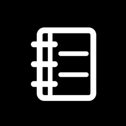

# BrightNotebook

Notes and a calendar for the Light Phone III, built against the real LightOS design
tokens rather than an approximation of them. Launcher label **Notebook**, package
`com.gios.lightnotebook`. Current release: **v1.58.0**.

## Install via BrightMarket

<p align="center">
  
</p>

Scan the code above with **BrightMarket** installed to open BrightNotebook there and
install or update it directly. Don't have BrightMarket yet? Get it, and browse
every Bright app, at
**[brightmarket.gzl.dev](https://brightmarket.gzl.dev)**.

Three buttons at the bottom and nothing else: a list, a plus, a calendar. Notes are
plain text carrying their own markers (`**bold**`, `- `, `1. `) so a note stays readable
anywhere it ends up. The calendar is a single zoomable wall planner — weeks running
downward, epoch-day entries, pinch to zoom between Month/Week/Day — rather than a page
of months. A camera button feeds a photographed page or planner to Claude Haiku, which
either transcribes it into a note or extracts it into calendar events. If
[BrightPasses](https://github.com/gi-os/BrightPasses) is installed, its ticket stubs show up
on the day they screen.

This is a **plain sideloaded APK, not a Light SDK tool** — the SDK's dependency
allowlist has no CameraX, so nothing that photographs a page can be built against it.
See [gi-os/BrightPasses](https://github.com/gi-os/BrightPasses) for the shared skeleton this
repo (and every other camera-carrying Light* app) is built from.

## Quick start

```sh
git clone https://github.com/gi-os/BrightNotebook.git
cd BrightNotebook
./gradlew :app:assembleRelease
adb install -r app/build/outputs/apk/release/app-release.apk
```

You need JDK 17 and the Android SDK (`compileSdk` 35, `minSdk` 29). The keystore is
committed at `keystore/lightnotebook.jks` on purpose — see
[Signing](#signing-and-releases) below — so a release build made from a fresh checkout
installs over an existing one instead of failing with Obtainium's `Failure: Invalid`.

To pick up notes, calendar entries and Claude vision parsing with no further setup, that
first install is already the whole app. The camera page needs an Anthropic key (see
[Configuration](#configuration)); everything else — notes, the wall planner, reminders,
importing other calendars — works with none.

## Configuration

- **Anthropic API key.** Settings → paste it, or **SCAN QR**: put your key into
  <https://gi-os.github.io/BrightNotebook/> (client-side, generated in the browser, the
  key never leaves the page) and point the camera at the resulting code. The scanner is
  [gi-os/LightQR](https://github.com/gi-os/LightQR)'s CameraX analyzer, wrapped in a
  Light-styled screen. Typing and the calendar work with no key at all; only the camera
  page needs one, at roughly a fraction of a cent per photograph.
- **Reminders.** Settings → REMIND ME sets the default lead time (ten minutes, or
  never); any entry's own row can override it. Reminders are
  `setExactAndAllowWhileIdle` (the throttled `setAndAllowWhileIdle` fires roughly once
  every nine minutes under Doze, which is useless for a fixed time), re-armed at boot
  and at every launch since alarms don't survive a reboot or a force-stop. The
  notification box that lights the panel needs one manual grant, because Android 14
  gates it behind an appop LightOS has no settings screen for:

  ```sh
  adb shell appops set com.gios.lightnotebook SYSTEM_ALERT_WINDOW allow
  ```

  Without it the notification and the buzz still arrive; only the panel stays dark.
- **Importing calendars.** Settings → CALENDARS. Import a `.ics` file (parsed directly,
  `RRULE` and all — a weekly meeting arrives as a weekly meeting) or import from the phone's
  own calendar provider via `CalendarContract.Instances` (already expanded at the source).
  Each import is a labelled, hideable, removable source; re-importing the same source
  **replaces** its events rather than duplicating them.
- **Subscribing to a calendar URL.** Settings → CALENDARS → *Subscribe to a URL*. Any
  published `.ics` feed (or a `webcal://` link, which is rewritten): fetched on the spot so a
  wrong address says so immediately, then re-fetched by the same hourly refresh as every
  other import. Scan the address rather than typing it — a feed URL carries a long random
  secret, and the QR field on
  [gi-os.github.io/BrightNotebook](https://gi-os.github.io/BrightNotebook/) makes one in the
  browser. The calendar names itself from `X-WR-CALNAME` if the feed says so, otherwise from
  its host.

  This is how a **work calendar** gets here. Microsoft 365 and Google both need an OAuth
  client the LPIII cannot run, so something else holds the account and publishes one file:
  [BrightSync's](https://github.com/gi-os/BrightSync) `calendar_bridge.py` does exactly this
  against Microsoft Graph, and — because it reads `calendarView` rather than an export —
  recurring meetings arrive as individual instances, which is the one thing importing a raw
  `.ics` cannot give you.
- **US federal holidays, with a glyph each.** Computed on the phone from the rules — eleven
  dates, no network, no key, no cache to go stale — and drawn as a small icon in the corner of
  the day: a tree on Christmas, an eight-pointed firework on the 4th, a bell for MLK Day. They
  ride in as ordinary all-day rows, so they need no table, no `DayTimeline.Item` of their own
  and no exhaustive `when` anywhere. **Observed dates are separate entries**: a Saturday
  Independence Day puts the fireworks on the Saturday and "Independence Day (observed)" on the
  Friday you actually have off, which are two different facts about the week.
- **The zone imported times are read in is visible, and can be overridden.** Settings →
  CALENDARS → TIME ZONE. An `.ics` carries instants, so turning one into "9:30 Tuesday" needs a
  zone; everything typed here is already local and needs none. A phone that reports the wrong
  zone therefore shifts every imported meeting by hours and leaves everything you wrote
  correct — a confusing thing to look at, and impossible to diagnose from the calendar alone.
  The row shows what the app actually resolved, so it is a readout as much as a setting.
  Changing it re-reads every subscribed calendar, because the stored rows were converted with
  the old one.
- **Mirroring to the phone's calendar.** Entries are written into a writable
  `CalendarContract` calendar when one exists; the notebook stays the source of truth,
  so deleting an entry removes both copies. The LPIII has no Play Services, so this is
  silently a no-op if there is nothing to write to.
- **BrightControl** (optional, separate app) rebinds the wheel click and camera button
  phone-wide — brightness, flashlight, camera — and passes bare wheel turns straight
  through to `com.gios.*` so BrightNotebook keeps handling its own scrolling and planner
  panning:

  ```sh
  adb install -r LightControl-v1.0.x.apk
  adb shell settings put secure enabled_accessibility_services \
    com.gios.lightcontrol/com.gios.lightcontrol.keys.ControlService
  adb shell settings put secure accessibility_enabled 1
  adb shell appops set com.gios.lightcontrol WRITE_SETTINGS allow
  adb shell appops set com.gios.lightcontrol SYSTEM_ALERT_WINDOW allow
  ```

## Usage notes worth knowing

- **Things that repeat.** Open an entry → *Repeats*: daily, weekly, monthly or yearly, an
  interval, which weekdays for a weekly one, and an end — never, after a number of times, or on
  a date. A series is **one row in the database**, not one row per occurrence: the rule is
  stored as an RFC 5545 `RRULE` and the days it lands on are worked out for whatever window is
  on screen. That is what makes importing a ten-year daily meeting from a feed cost one row
  instead of three and a half thousand, and it is why `.ics` recurrence — which this app used to
  skip on purpose, showing a weekly standup exactly once — works now: both halves are the same
  engine, `util/Recurrence.kt`.

  It reads `FREQ`, `INTERVAL`, `BYDAY` (including `1MO` and `-1FR`), `BYMONTHDAY`, `COUNT`,
  `UNTIL` and `EXDATE`, and **refuses the rest** — `BYSETPOS`, `BYWEEKNO`, `BYYEARDAY`, a
  non-Monday `WKST`, sub-daily frequencies — rather than expanding them wrongly. A refused rule
  is not dropped: the event appears once, on the day it really starts, and the *Repeats* row
  says the app cannot read it. Monthly on the 31st **skips** a month that has no 31st, which is
  what the standard says; "the last day of every month" is the *LAST* option in the picker.

  Editing or deleting one occurrence always asks: **just this one**, or **all of them**. "Just
  this one" writes an exception date for that day; editing detaches that occurrence into an
  entry of its own first, so what you type lands on that day only.

- **Checkboxes in a note.** A line typed as `- [ ] milk` draws a real checkbox, and tapping it
  rewrites that line to `- [x] milk`. **The text is still the note** — there is no separate
  checkbox model, nothing to migrate, and a checklist exported or read anywhere else is still
  the same five characters. The rewrite is addressed by line number, never by matching the text,
  so two identical `- [ ] milk` lines tick independently; the glyph is its own tap target, so
  ticking something off does not put the caret in the note or raise the keyboard.

- **A day reads as a diary once it has happened, and as a calendar until then.** There is no
  diary mode and no calendar mode: there is a *now line*, and everything follows from which
  side of it a thing falls on. A day in the past is entirely behind the line and reads as a
  page of what happened; a day ahead is entirely in front of it and reads as a plan; **today is
  both**, split by a `NOW` rule wherever the clock is. Photographs sit in the column in the
  order they were taken, among the things written that day.

  **Notes you wrote or came back to appear on the day too**, at the time you touched them,
  marked "Wrote this" or "Came back to this" and opening the note on a tap. This needs no bridge
  and no permission — `NoteEntity` already carries `createdAt` and `updatedAt`. One row per note
  per day: a note written *and* returned to on the same day counts as the writing, because a
  second row saying you also edited the note you had just written is noise. Only the last edit of
  a day is knowable, `updatedAt` being one column, which is a limit of the schema rather than a
  choice.

  **A day ends when you go to bed.** A journal day runs from four in the morning to four the next
  morning, so a photograph taken at 1am belongs to the night you were having rather than to a morning
  you had not started. Everything agrees about it — photographs, notes, entries, steps, screen time,
  the now line, the planner's highlighted cell — because they all ask one object, `util/JournalDay`.
  A vertical position in a cell is measured from the cutover too, so a late night runs down the
  bottom of the day it belonged to instead of reappearing at the top of the next one.

  The day carries **its own shape** in a line under the title: when it started and stopped, and
  when it got light and dark. Sunrise is **computed, not fetched** — the NOAA algorithm from a date
  and a place, so it works offline for any date in either direction, and polar latitudes come back
  as "the sun does not set" rather than as a missing value. It needs somewhere to be, and nothing
  on this phone records that yet, so Settings → Daylight holds a home position; when a location
  recorder lands, the day's own coordinates should win for days that have them.

  At the very bottom, **On this day**: one photograph from the same date in each previous year that
  has one, with the year under it. Quiet and last on purpose — it is the least urgent thing on the
  screen and the most rewarding to come across, which is the wrong order to put at the top. Shown
  on an empty day too, since a day you wrote nothing on is exactly the one whose only record is
  what it sat on top of.

  A reminder is not offered on something that has already happened — it counts back from a
  time, and there is nothing left to count back to — and a new entry on a past day does not
  take the default one. Times stay either way, because "we ate at eight" is a real thing to
  write about a day that has gone.

  Photographs taken within twenty minutes of each other collapse into **one moment**. That is
  not a nicety: a single picture is drawn full width the way a photograph in a diary is, and
  eleven shots of the same thing drawn that way would be eleven screens of scrolling with
  everything written that day pushed out of reach underneath. A burst becomes a row of
  thumbnails instead, which keeps a heavy day bounded. The gap is measured from the previous
  photograph rather than from the run's start, so a long afternoon of steady shooting stays one
  moment instead of breaking into arbitrary twenty-minute blocks.

  **Zoom in one stop and the cells carry the photograph itself** — the day's first, centre-cropped
  behind whatever is written on it and knocked back hard with black, so it reads as texture
  rather than as a picture. The scrim is not a nicety: at full brightness a photograph and white
  text are the same luminance in patches, and on a greyscale panel there is no colour left to
  separate them. Never on today, which is the inverted block — the one cell whose state has to be
  unmistakable. **Days that have gone are struck through** with a single faint diagonal, an X
  reading as cancelled where one stroke reads as spent; suppressed over a photograph, where a
  line across the cell reads as damage to the picture.

  This is the one place the "no bitmaps in the planner" rule bends, and the arithmetic is why:
  zoomed out there are forty-two cells, but once they carry entries there are about a dozen, and
  a dozen small thumbnails decoded **once, off the draw path** and held as `ImageBitmap` cost
  nothing per frame. The draw only ever reads an already-decoded map; a day whose picture has not
  arrived draws no picture, and zooming back out drops them all.

  In the month grid a day with photographs carries a hollow square, next to the filled dot that
  means something is written there. A filled mark for *written*, an outlined one for
  *photographed* — a frame, which is what a picture is, and the two stay legible on a cell three
  millimetres wide in a way that two dots would not.

  There is **no bridge to Roll** doing this, and that is the point. [Roll](https://github.com/gi-os/Roll)
  writes every exposure to MediaStore because that is what a camera does, so asking the
  system what was photographed on a day answers with Roll's pictures, the stock camera's, a
  screenshot, and anything else — with no content provider, no `<queries>` entry, and no
  release of the two apps in step. The cheapest integration is the one where neither app
  knows the other exists.

  Long-press a frame to file it against the day as an entry, which is what lets a
  photograph be given a time, a reminder, or moved to another day like anything else here.
  Read-only: filing a photograph stores its uri, and never copies, moves or edits the file.
  Reading the library needs `READ_MEDIA_IMAGES`, asked for from the strip itself rather than
  at first launch, so the reason is on screen when the dialog is.

  The month grid gets a mark and not a thumbnail on purpose. Forty-two cells re-measuring
  text per drag frame is the whole reason the planner is one `Canvas` instead of
  composables, and decoding bitmaps into it would undo that at the first pinch. The grid
  says *whether*; the day screen shows *what*.
- **Pages are photographed by Roll, plainly.** `ADD → Camera` hands the shot to Roll when
  it is installed and falls back to the camera built in here when it isn't. Roll pins its
  capture to 4000x3000 rather than the sensor's full 50MP, which is the difference between a
  shutter that answers and the one-to-three-second lag this phone is known for.

  It is served **with no filter**, and that needed a change on Roll's side: a capture
  request is plain unless the caller passes `EXTRA_ALLOW_FILTER`. Roll's dial might have
  been resting on Game Boy three days ago, a dithered page is illegible to Claude, and the
  failure would have surfaced here as "the notebook can't read my handwriting" with nothing
  on screen to explain it. Attaching a photograph to a note is the case that will opt in.

- **Another app can keep a note here.** `lightnotebook://note/<key>?title=<label>` opens
  the note filed under `<key>`, and makes it if this is the first ask. The key is opaque
  to this app — it only has to find the same row again — and is held in a unique
  column, so two taps at once cannot produce two notes.
  [BrightChat](https://github.com/gi-os/BrightChat)'s contact page is the caller today: it
  keeps one note per iMessage conversation and asks by the conversation's normalised
  handles, never by a chat guid, so restoring a Mac backup does not strand every note. The
  filter is `DEFAULT` and deliberately not `BROWSABLE`: it creates a database row from an
  unauthenticated intent, and a web page has no business doing that.
- The wheel scrolls whatever is on screen — notes, a day, the agenda, settings, the
  list of calendars, a photographed page's transcription — and pans the wall planner
  when nothing is being pinched. It works with nothing else installed: LightOS relabels
  the optical sensor's scancodes `WHEEL_CCW`/`WHEEL_CW` in a patched
  `Generic.kl`, and the app claims them in `dispatchKeyEvent`, ahead of the view
  hierarchy, so a turn still pans the day while a text field has focus.
- The calendar's Month/Week/Day zoom stops are snapped to, not free scroll; the open day
  is composed into the exact cell you pinched, so pinching out returns to that same
  square instead of navigating to a separate screen.
- Typing `9:30 dentist` sets a time; a bare leading number is deliberately not a time
  (`3 loads of laundry` is not an appointment at three).
- Photographing from the CALENDAR tab tells the model to expect dates; from NOTES it
  decides for itself between transcription and event extraction.
- The camera is a real capture, not a grab of the preview frame: `camera/PageCamera.kt` is
  LightCamera's engine cut down to this one job — an `ImageCapture` asking for a ~3000px
  long edge, tap-to-focus with the bracket driven by the camera's own `CONTROL_AF_STATE`,
  and flash off/auto/on. The old path grabbed `PreviewView.bitmap`, which is preview
  resolution focused on whatever the camera guessed at, and is why biro came back `[?]`.
  Deliberately not `CAPTURE_MODE_ZERO_SHUTTER_LAG`: this camera accepts it, binds, then
  fails every `takePicture`.
- **The photograph is kept.** It used to be deleted the moment Claude had read it, which
  made a misread word impossible to settle. Any note or event that came from the camera
  can show the page it was read off — from its actions sheet, or the camera icon while
  reviewing what was found. The file is deleted only when nothing points at it any more.
- Parsed events are editable before they land: tap one to fix what it says, which day it
  is on, or what time. Long-press keeps or drops it. A model reading biro gets one of
  those wrong often enough that "drop it and retype it" is the wrong only option.
- A day entry can be moved to another day after the fact, and a note can become an event
  from MORE → *Put it on the calendar*, which asks for a day and a time and leaves the
  note where it is.
- The vision prompt is written for handwriting first: cursive, print and a mix; the
  writer's own abbreviations kept as written; crossed-out words skipped; margin
  insertions placed where the arrow points; and `[?]` only for a word that genuinely
  cannot be read, never a plausible guess. Captures are sent at a higher resolution than
  a printed page would need, because the difference between a 3 and an 8 in biro is a
  few pixels.

## Reporting a glitch

Shake the phone twice — there and back, there and back — and a small **SEND ERROR?**
chip appears in the corner. Tap it within four seconds and the report sheet opens; ignore
it and it fades, costing you nothing. Answer yes and it files a GitHub issue against the private `gi-os/light-reports`
tracker carrying what went wrong, the build and firmware it happened on, which screen you
were on, the last crash log if there is one, and — only while the row stays ticked — a
screenshot of the moment you started shaking. The same sheet is on the settings screen
under **SEND A REPORT**, for when shaking a phone in public is not appealing.

If the app dies, the next launch offers the stack trace instead of losing it. Nothing is
sent from the dying process: the trace goes to a file, and a healthy launch asks about it.

Some things about how it is built that are easy to get wrong:

- **The question is a chip in the corner, not a sheet**, which is what lets the gesture be
  loose. A shake the phone misreads costs four seconds of a small box you can ignore, rather
  than a modal across a 3.92" screen asking about something you did not ask about. Silence
  is an answer, and it is the safe one — nothing is deleted by letting it fade, and an unsent
  crash log is offered again on the next launch. So `util/ShakeGesture` sits nearer the loose end than
  the strict one: four reversals of the deviation from rest past 0.46g, each within 500ms of
  the last. Six past 0.55g never fired; three past 0.38g fired on its own. It counts
  *reversals* rather than force, which is what separates a flick from a bag or a dropped
  phone — a walk peaks around 0.3g, and a drop is one jolt rather than three turns. Plain
  arithmetic with no Android imports, so `ShakeGestureTest` holds it to that.
- **The settings screen shows the accelerometer live** — current g, the peak of the last two
  seconds, and turns counted. There is no other way to answer "I shook it and nothing
  happened" on a phone with no logcat attached.
- **Failures the app catches offer themselves**, through `report/Trouble`, so the quiet ones
  that leave a screen looking ordinary get reported too. Rate-limited to once an hour per
  failure, because an app that asks twelve times before lunch is one you switch off.
- **The accelerometer runs only while the app is in front**, registered in `onResume` and
  dropped in `onPause`. A 50Hz stream is a real battery cost, and shaking a phone showing
  something else is not a complaint about Notebook.
- **The screenshot is taken at the moment of the shake**, not when the sheet asks for it —
  by then the sheet is what is on screen. `PixelCopy` off this app's own window, which is
  why no permission is involved.
- **Reports queue on disk first and post afterwards, always.** A phone reporting a freeze is
  by definition one that was just misbehaving, and a report that exists only in flight is the
  one guaranteed to be lost. The queue drains on the next launch.
- **The screenshot rides inside the issue body as base64**, downscaled to 360px and
  desaturated. Attaching a file would need `contents: write` on a token that ships inside a
  sideloaded APK anyone can unzip; kept to `issues: write`, the worst a lifted key can do is
  write junk into one private tracker.

The key is `REPORT_TOKEN` — a fine-grained PAT with **Issues: read and write** on
`gi-os/light-reports` and nothing else, and it is set as a repository secret, so any build
from `main` carries it. For local builds put it in `local.properties` as `reportToken=`.

A build without one still compiles and still collects reports; they wait on the phone until a
build that has one installs over it, which is what makes the key safe to be missing.

The scope was checked rather than assumed. With that token: filing an issue on `light-reports`
succeeds, opening one on this repo is 403, and writing repository contents anywhere — including
`light-reports` itself — is 403. Anyone who unzips the APK gets the ability to write junk into one
private tracker, and nothing else. It expires and will need replacing; when reports stop arriving
and the settings screen starts counting a queue, that is the first thing to check.

## Build and test

```sh
./gradlew :app:assembleRelease        # signed release APK
./gradlew :app:testDebugUnitTest      # markdown, date, planner-geometry logic
python3 scripts/generate_icon.py      # regenerate the launcher icon (needs Pillow)
```

97 unit tests cover the markdown/list round-trip, date and reminder-timing parsing,
QR-payload validation, `.ics` folding and timezone handling, and the planner's zoom
arithmetic — all of it in code deliberately free of Android imports
(`util/NoteMarkdown.kt`, `util/NoteDates.kt`, `util/CanvasMath.kt`) so it runs off-device.
CI runs this suite before assembling, which is also what exercises Room's KSP codegen.

The Room schema migrates rather than resets — version 2 added calendars, reminders and
import provenance as a real `Migration` — because `fallbackToDestructiveMigration` is
only harmless until somebody's notes are in the database.

## Signing and releases

Every push to `main` runs `:app:testDebugUnitTest`, assembles, verifies the signing
certificate against `signing-fingerprint.txt`, verifies a launcher icon is present, and
publishes a signed GitHub Release — **a push is a release trigger, not a cosmetic
action.** `versionCode`/`versionName` are not fixed in the committed
`app/build.gradle.kts` (which carries a `1.0.0` placeholder); CI stamps
`versionCode = <run number>` and `versionName = 1.0.<run number>` on every run, which is
why release tags are `v1.0.<n>` in strict sequence. Point
[Obtainium](https://github.com/ImranR98/Obtainium) at this repo, or install by hand:

```sh
adb install -r LightNotebook-v1.0.<run>.apk
```

## Contributing

Issues and pull requests welcome. Keep new logic that doesn't need `android.*` (parsing,
date math, geometry) in the Android-free `util/` files so it stays unit-testable
off-device, and add tests alongside it. Don't reintroduce
`fallbackToDestructiveMigration` on the Room schema. If you touch the calendar's
gesture handling, note that the pan/zoom loop is hand-rolled (not
`detectTransformGestures`) specifically because that API has no end-of-gesture hook and
the snap-to-stop behavior needs one.

## Version history

Tags are stamped by CI (`v<major>.<minor>.<run number>`) on every push to `main`; each
one below is a real tag against the commit shown. A branch that is not `main` runs
`check.yml` instead, which compiles and tests and publishes nothing.

`RELEASE_NOTES.md` is the body of the GitHub release, and holds **this release and only this
release** — rewrite it rather than appending, the way `gi-os/LightCamera` does. The table below
is the running index; the archive is the list of releases itself. A release that fixes something
reported through shake-to-report names the report it closes, so the history says what was *fixed*
and not only what changed:

    Fixes [light-reports#12] — the day screen scrolled to the wrong hour after a pinch.

| Version | Commit | Change |
| --- | --- | --- |
| v1.58.0 | (on main) | Fahrenheit on the calendar, and day-stepping arrows in the day view's header |
| v1.57.0 | (on main) | Spending on the day and bills on the calendar, from BrightLedger; a next-up row for BrightControl's lock face |
| v1.56.0 | (on main) | A recurring event keeps its reminder through the hourly sync |
| v1.43.0 | (on main) | The first page scan asks for the camera instead of crashing |
| v1.42.0 | `b61f88e` | Things that repeat, and checkboxes you can tick |
| v1.40.0 | `070b5a8` | One arrival per zone per minute, so the day screen stops closing itself |
| v1.39.0 | `6a63041` | Calls, charging and where the screen time went — and one fewer hourly wakeup |
| v1.38.0 | `079fd1c` | Entries and instants share one axis, so a day is in order |
| v1.37.0 | `b2a2fe5` | US federal holidays with a glyph each, and a time zone you can see |
| v1.36.0 | `774d361` | Subscribe to a calendar URL, so a work calendar can live here |
| v1.35.0 | `36cc68e` | The report offer is a corner chip that fades, not a sheet |
| v1.34.53 | `30b6e63` | The star sits on the print, and a tall photograph fills its frame |
| v1.33.0 | (folded in) | The pile scatters instead of batching, and stops popping as you scroll |
| v1.32.49 | `0053c07` | The pile scrolls, a starred photograph leads it, and it stops covering the text |
| v1.31.48 | `deebd09` | Prints keep their own shape, and sit at their own angle and height |
| v1.30.47 | `35b3138` | Places get names, and photographs a pile you scroll through |
| v1.29.46 | `828db48` | Went home, went to work |
| v1.28.0 | (on main) | Reports actually leave the phone |
| v1.27.44 | `5a010f8` | The shake lands between too stiff and too eager |
| v1.26.43 | `2a849d6` | Weather on the planner, pull a day to refresh, and the fetch says what it did |
| v1.25.0 | (on main) | A flick reports a glitch, the app reports itself, releases carry notes |
| v1.24.41 | `9321442` | Who you talked to, from BrightChat |
| v1.23.40 | `7d30795` | Fill in the weather now, as far back as there is data |
| v1.22.0 | (on main) | Shake the phone to report a glitch |
| v1.21.38 | `87626e3` | Weather, archived overnight; artists named; a place gets a pin |
| v1.20.37 | `4dbffea` | Music runs alongside the day, and the planner knows where you were |
| v1.19.36 | `d7fa722` | Pickups are part of the day, and nothing is anchored to the screen |
| v1.18.0 | (folded in) | Where you were and what you had on, from FogLight and LightPhono |
| v1.17.34 | `87204bf` | Multi-day events: a trip is one thing, on every day it covers |
| v1.16.0 | (folded in) | A starred photograph is the one a day shows |
| v1.15.32 | `802b85b` | Hours down the gaps, pages actually centred, and the day's first line scrolls |
| v1.13.31 | `6d84c19` | Entries sit at the time they happened, and photographs lean opposite ways |
| v1.13.31 | `6d84c19` | Entries sit at the time they happened, and photographs lean opposite ways |
| v1.12.30 | `61681d4` | Colour everywhere, bars that get out of the way, centred pages |
| v1.11.29 | `253028e` | A handmade photo book: tilted prints, a full-screen viewer, and colour |
| v1.10.28 | `bb4e567` | Time between moments is drawn, and photographs tile like a page |
| v1.8.27 | `d475d85` | A day ends when you go to bed, not at midnight |
| v1.7.26 | `0bdc60a` | Steps by the hour, screen time, and daylight down the calendar's cells |
| v1.6.25 | `526fb1d` | The day's shape: bookends, daylight, and the same date in years before |
| v1.5.24 | `0aa0e07` | Notes you wrote or came back to are part of the day |
| v1.4.23 | `23310f9` | The planner's cells carry the day's photograph, and days gone are struck through |
| v1.3.22 | `3b164d8` | A day past is a diary, a day ahead is a calendar, today is both |
| v1.2.21 | `069462c` | Photographs on the calendar, and pages photographed by Roll |
| v1.1.20 | `23aff15` | One note per thing another app owns: `lightnotebook://note/<key>` |
| v1.0.17 – v1.0.19 | | Keep the photograph and let a transcription be corrected; LightCamera's capture engine |
| v1.0.16 | `dd4a3c2` | Separate what the notebook does with the wheel from what BrightControl does |
| v1.0.15 | `74028be` | Weekday letters live on the surface, and detail arrives earlier |
| v1.0.14 | `398578f` | Drop the NEXT UP footer, and fix the bars vanishing after a pinch out |
| v1.0.13 | `e601d6d` | Dim the neighbouring months by half |
| v1.0.12 | `40897d5` | Scroll with the wheel |
| v1.0.11 | `8cd4273` | Sliding between days moves the planner, not just the contents |
| v1.0.10 | `0923bf4` | Opening a day no longer throws the planner back out to the month |
| v1.0.9  | `525ead5` | The cell becomes the day: no second screen, sliding between days works |
| v1.0.8  | `ad2a13c` | Make the zoom carry through, float the bars, fix back landing on Notes |
| v1.0.7  | `b8641bd` | The calendar is a zoomable wall planner |
| v1.0.6  | `022c641` | Fix the agenda crash, fold tickets into their calendar entries, sync hourly |
| v1.0.5  | `db438ae` | Times with reminders, labelled calendars you can import into, agenda screen |
| v1.0.4  | `d4f52d6` | Show BrightPasses films on the calendar, open the stub when tapped |
| v1.0.3  | `6a1ca4d` | Icons on the bottom bar, and highlight the day you are looking at |
| v1.0.2  | `253b8f7` | Scan the API key in-app, with LightQR's scanner |
| v1.0.1  | `6106690` | Initial release: notes, folders and a calendar for the Light Phone III |

## License

MIT. Vector drawables and design tokens in `ui/theme/` are ported from
[lightphone/light-sdk](https://github.com/lightphone/light-sdk) (MIT); see
`LICENSE-light-sdk`.

<!-- bright-footer:begin -->
---

## Bright\*

**It's not Light, it's Bright.**

26 open-source apps for the **Light Phone III** — camera, music, maps, messages,
reading, transit, games. The phone has no app store, so they install by sideload: scan one
code from **[brightmarket.gzl.dev](https://brightmarket.gzl.dev)** and BrightMarket keeps them updated.

[Roll](https://github.com/gi-os/Roll) · **BrightNotebook** (you are here) · [BrightControl](https://github.com/gi-os/BrightControl) · [BrightWay](https://github.com/gi-os/BrightWay) · [BrightChat](https://github.com/gi-os/BrightChat) · [browse all 26 →](https://brightmarket.gzl.dev)

The Light Phone does not sponsor or endorse any of these. Built by
[Giovanni Lupo](https://github.com/gi-os) — if this one is useful to you, a ⭐ helps the next
person find it.
<!-- bright-footer:end -->
